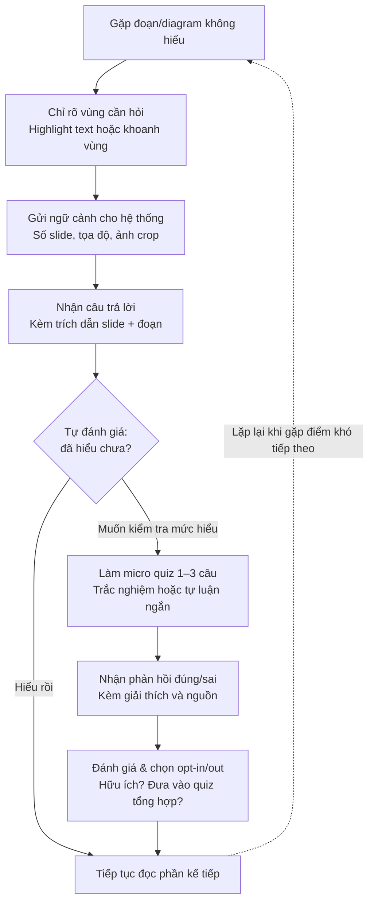

# AI SPEC — [AI tạo quiz phần bài giảng khó hiểu cho sinh viên] · Nhóm [B6-1] · Zone [3]
Hướng: [✅] A — VLearn  [ ] B — Trợ lý Học viên  [ ] C — Làn mở
Loại: [ ] Tối ưu tính năng có sẵn  [✅] Tính năng mới

## §1. User & Job
- Job executor + workflow (đính kèm worksheet JTBD / ảnh sơ đồ):
    ## Workflow  

- Core JTBD (không tên sản phẩm/AI trong câu):
    Xác minh mức độ hiểu của mình về một đoạn nội dung cụ thể ngay khi vừa đọc xong, trước khi chuyển sang phần tiếp theo.
- Problem statement (KHÔNG chữ AI):
    Khi học viên tự học một bài giảng slide và gặp một đoạn văn, diagram hoặc bảng biểu cụ thể không hiểu, họ khó diễn đạt chính xác điều mình muốn hỏi và thường phải rời khỏi tài liệu để tra cứu ở nơi khác, khiến mạch đọc bị ngắt. Vì không có cách nào xác nhận ngay tại chỗ liệu mình đã hiểu đúng hay chưa, họ tiếp tục học dựa trên một hiểu biết chưa chắc chắn — và vấn đề chỉ lộ ra khi làm quiz tổng hợp cuối buổi, lúc đã quá trễ để quay lại đúng phần đó.
- Evidence (chuẩn A và/hoặc B — log đầy đủ trong repo):
  - 20/45 (44,4%)
  - ≥5 quote/ví dụ nguyên văn + nguồn:
    +Khi phát hiện mình hiểu sai, điều đó ảnh hưởng thế nào đến việc học của bạn 
    +Nếu có 1 công cụ AI tự động sinh câu hỏi ôn tập, nhắm đúng phần bạn còn yếu, bạn có sẵn sàng dùng thử không?
    +Bạn đã từng dùng cách nào để tự kiểm tra mức hiểu bài? Nếu chưa có, vì sao không dùng thường xuyên?
    +Bạn thích với câu hỏi ôn tập dạng nào? 
    +Bạn thường xuyên sai kiến thức ở dạng nội dung nào nhất?

## §2. Impact & quyết định chọn

### Bảng impact ≥3 ứng viên

| # | Ứng viên  | Bao nhiêu người gặp (từ evidence) | Tần suất | Mỗi lần tốn gì | Khả thi (Sketch/Mock/Working) |
|---|---|---|---|---|---|
| 1 | Học viên thường xuyên sai kiến thức lý thuyết vừa học | 25/45 | - |mất thời gian xem lại nhiều lần | working|
| 2 |  | từng dùng các cách quiz/AI/ hỏi tutor để tự kiểm tra mức hiểu bài | 57,8% |tốn thời gian và công sức | working |
| 3 | sinh viên thích câu hỏi dạng tự luận ngắn | *[số + nguồn]* | 6,7 %| *[tốn gì]* | Mock |

---

### Ứng viên ĐÃ LOẠI + vì sao

**Ứng viên loại #1: Phạm Sỹ Đức
- Lý do loại: thích tự luận ngắn, nằm trong 6,7%, quá ít.

**Ứng viên loại #2: Nguyễn Quang Huy
- Lý do loại : thích tự luận ngắn , trong 6,7%

---

### Ứng viên CHỌN + vì sao (bằng số)

**Ứng viên chọn: Nguyễn Việt Thắng

- Lý do chọn: Thích kiểm tra bằng quiz sau mỗi bài, chiếm 57,8%
 

## §3. Giải pháp tương tự đã nghiên cứu

| Sản phẩm | ① Họ giải job này bằng flow nào? | ② Một điều đáng học (quan sát cụ thể) | ③ Một điều đáng né | ④ Mình khác gì ở lát cắt này |
|---|---|---|---|---|
| NotebookLM | có thể tạo quiz tự nhiều bài giảng gộp lại | có mục tạo quiz riêng| làm khá chung chung | khi sinh viên khó hiểu 1 phần trong slide hỏi phần nào AI sẽ đào đúng sâu phần đó |
| vlearn AI | bôi đen phần cần hỏi cho AI | có hệ thống AI tiện ích gần slide  | AI chưa bao quát được context | cung cấp context đủ rộng cho từng phần để AI hiểu |

## §4. Thiết kế

### Lát cắt MỘT CÂU
sinh viên chưa hiểu rõ bài bôi đen/khoanh vùng phần đó rồi AI lấy kiến thức bao quát và đưa về lời giải thích đầy đủ kèm quiz.

---

### Non-goals (≥3 thứ KHÔNG build)

1. AI tự động hỏi khi sinh viên không cần
2. AI trích dẫn thông tin bên ngoài (dễ HL)
3. AI hỏi thêm các câu bên ngoài 

---

### Mức prototype nhắm tới

- [ ] Sketch — Màn hình dựng nhanh + 1 AI call chạy demo được
- [✅] Mock — Flow bấm được, data giả, AI thật ở lõi
- [✅] Working — Chạy end-to-end với data pack thật

**Phần nào mock, phần nào thật:**
- Thật: lời gọi AI chấm hiểu-đúng/sai/mơ hồ tại quyết định trung tâm
- Mock:  đăng nhập, danh sách buổi học lấy từ data giả cứng sẵn

---

### Automation

- [ ] Augment — AI gợi ý, người quyết
- [✅] Conditional — AI tự làm case chắc, chuyển người case mơ hồ
- [ ] Automate — AI tự làm

**Lý do theo cost-of-error**: kiến thức giáo dục không được sai, nên yêu cầu nếu không chắc phải để cho người dùng, không để AI tự quyết hoàn toàn.

---

### §4b. Nguyên tắc đã áp dụng (≥4 — HAX/PAIR)

1. Grounding – Trả lời có căn cứ, không suy diễn ngoài phạm vi tài liệu

Đây chính là nguyên tắc được thể hiện rõ nhất trong mục 10.3 của PRD. Chatbot chỉ được phép trả lời dựa trên nội dung PDF và Markdown của bài giảng (mục 10.1), tuyệt đối không dùng kiến thức bên ngoài rồi trình bày như thể nó đến từ slide. Khi hệ thống không tìm đủ căn cứ để trả lời, thay vì tự bịa ra nội dung, chatbot sẽ hiển thị thông báo "Nội dung hiện tại chưa được giải thích đầy đủ trong bài giảng" thay vì cố gắng trả lời bằng mọi giá. Nguyên tắc này giúp tránh hiện tượng ảo giác (hallucination) — lỗi phổ biến và nguy hiểm nhất của các hệ thống AI tạo sinh khi áp dụng vào giáo dục, nơi thông tin sai lệch có thể khiến người học hiểu nhầm kiến thức.

2. Transparency – Minh bạch nguồn gốc câu trả lời

Mọi câu trả lời của chatbot đều bắt buộc phải hiển thị số slide và đoạn trích liên quan (mục 10.2, 7.2, và các tiêu chí AC-01, AC-02). Người học không phải "tin mù" vào AI mà có thể tự đối chiếu ngược lại slide gốc để kiểm chứng. Nguyên tắc này giúp xây dựng lòng tin (trust calibration) giữa người dùng và hệ thống AI, đồng thời cho phép người học đánh giá được mức độ tin cậy của từng câu trả lời thay vì chấp nhận nó một cách thụ động.

3. User control – Trao quyền kiểm soát cho người dùng

Nguyên tắc này thể hiện qua cơ chế opt-out ở mục 8.5: sau mỗi micro quiz, người học có toàn quyền quyết định câu hỏi đó có được đưa vào quiz tổng hợp cuối bài hay không, và có thể thay đổi lựa chọn này bất cứ lúc nào trước khi bắt đầu làm quiz tổng hợp. Đặc biệt, mục 8.6 quy định rating và opt-out là hai hành động hoàn toàn độc lập — hệ thống không tự động loại một câu hỏi chỉ vì người học đánh giá thấp (mục 20.4). Điều này đảm bảo AI không âm thầm đưa ra quyết định thay người dùng, mà luôn để con người là người quyết định cuối cùng.

4. Human-in-the-loop – Con người xác nhận trước khi công bố nội dung chính thức

Ở phần AI tái tạo diagram (mục 14, 15), AI chỉ đề xuất phương án mới chứ không bao giờ tự động thay thế nội dung slide gốc. Giảng viên bắt buộc phải Approve, Regenerate hoặc Reject, và có thể chỉnh sửa thủ công trước khi hệ thống xuất bản phiên bản PDF mới (FR-24, FR-25, AC-09). Việc giữ con người trong vòng lặp kiểm duyệt trước các thay đổi có tác động lớn (ảnh hưởng đến toàn bộ người học) giúp giảm rủi ro AI tạo ra nội dung sai nhưng vẫn được lan truyền như một nguồn chính thức.

# §5. Kiểu lỗi — 4 lớp chỗ khó + kịch bản

*Bối cảnh sản phẩm: Hệ thống Bài giảng Slide + AI Hỗ trợ Học tập — PDF slide viewer, chatbot trích dẫn nguồn theo slide, micro quiz, quiz tổng hợp cuối bài (opt-out), smart suggestion, AI tạo lại diagram, quản lý phiên bản PDF.*

| # | Lớp | Tình huống cụ thể | Hành vi mong muốn (nói gì / hiện gì / cho user làm gì tiếp) | Nguyên tắc áp (G..) |
|---|---|---|---|---|
| 1 | ① Nguồn sự thật | Người học hỏi về một khái niệm chỉ được **nhắc tên nhưng chưa giải thích rõ** trong PDF/Markdown của bài giảng — không đủ căn cứ trong 1–2 file PDF được cấp. | AI phải trả lời đúng câu chuẩn đã định nghĩa trong PRD (mục 10.3): *"Nội dung hiện tại chưa được giải thích đầy đủ trong bài giảng"* — không tự suy diễn thêm rồi vẫn gắn nguồn slide như thể có thật; gợi ý người học hỏi giảng viên hoặc xem thêm slide liên quan. | G10 |
| 2 | ① Nguồn sự thật | Người học khoanh vùng một diagram nhiều bước; AI đọc sai một chi tiết/nhãn trong ảnh crop nhưng vẫn diễn giải trơn tru kèm trích dẫn đúng định dạng (số slide, đoạn trích), khiến câu trả lời sai trông như có căn cứ vững. | Trích dẫn chỉ được lấy từ chunk đã thực sự truy xuất theo metadata slide (mục 20.3 PRD — "chỉ cite chunk đã truy xuất"); nếu độ tin cậy đọc ảnh thấp, AI nêu rõ mức độ chắc chắn (vd: "mình chưa chắc chắn hoàn toàn về chi tiết này") thay vì khẳng định chắc nịch. | G11, G2 |
| 3 | ② Mơ hồ / thiếu thông tin | Người học đặt câu hỏi tự do kiểu "cái này là gì vậy" mà **không kèm highlight hay khoanh vùng**, khiến hệ thống không biết "cái này" đang chỉ tới slide/vùng nào. | AI hỏi lại 1 câu làm rõ (vd: "Bạn đang hỏi về phần nào — đoạn định nghĩa ở slide 5 hay diagram ở slide 6?") thay vì đoán đại slide người học đang xem gần nhất rồi trả lời sai ngữ cảnh. | G10 |
| 4 | ② Mơ hồ / thiếu thông tin | Người học khoanh một vùng **lẫn cả đoạn text và một phần diagram**, hệ thống không rõ nên giải thích theo hướng nào. | AI trả lời kèm giả định rõ ràng (vd: "Mình hiểu bạn đang hỏi về diagram trong vùng này, đúng không?"), đồng thời cho phép người học chỉnh lại vùng chọn hoặc bổ sung câu hỏi nếu giả định sai. | G9 |
| 5 | ③ Ngoài phạm vi / thẩm quyền | Người học yêu cầu chatbot **tìm kiếm thêm thông tin trên Internet** để trả lời đầy đủ hơn, dù chatbot chỉ được phép dùng PDF + Markdown nội bộ (mục 10.1, 4.2 PRD — "Tìm kiếm Internet trong chatbot" nằm ngoài phạm vi). | AI từ chối rõ ràng, giải thích giới hạn "chỉ trả lời trong phạm vi bài giảng đã cấp", gợi ý người học tự tìm nguồn ngoài nếu cần chứ không tự ý search giúp. | G1 |
| 6 | ③ Ngoài phạm vi / thẩm quyền | Người học yêu cầu chatbot **chỉnh sửa/thay nội dung slide trực tiếp** — quyền này chỉ thuộc giảng viên/admin qua workflow Approve / Regenerate / Reject (mục 15 PRD). | AI từ chối thực hiện, giải thích đây là quyền của giảng viên, gợi ý người học gửi đánh giá/phản hồi để giảng viên xem xét chỉnh sửa sau, chứ AI không tự sửa. | G1 |
| 7 | ④ Đặc thù domain | AI **trích dẫn sai số slide** trong câu trả lời (vd nêu "slide 5" nhưng nội dung thật nằm ở slide 7), khiến học viên tra cứu lại sai chỗ và hoang mang. | Mọi trích dẫn phải trace đúng theo metadata slide đã lưu khi chunk nội dung (mục 20.3 PRD); nếu không chắc chắn số slide, không nêu số cụ thể còn hơn nêu sai. | G11 |
| 8 | ④ Đặc thù domain | Micro quiz đưa ra đáp án tham khảo/giải thích **sai một kiến thức cốt lõi** nhưng trình bày rất chuyên nghiệp (đúng định dạng trắc nghiệm, kèm nguồn slide), khiến học viên tin, ghi nhớ nhầm và có thể bị tính sai điểm ở quiz tổng hợp. | Ngưỡng kiểm tra nghiêm hơn với câu hỏi liên quan kiến thức cốt lõi — thà báo "chưa chắc chắn" hoặc bỏ câu đó còn hơn xác nhận nhầm; kết hợp cơ chế rating "đáp án có vẻ không chính xác" đã có sẵn ở mục 8.4 PRD để gắn cờ cho giảng viên. | G2 |

## §6. Bốn đường đi của trải nghiệm

### Happy path
*(user dùng đúng ý định thiết kế, AI có đủ căn cứ, kết quả rõ ràng)*

Học viên trả lời đúng ý chính → AI xác nhận "hiểu đúng" kèm trích dẫn đoạn tài liệu liên quan → học viên yên tâm chuyển sang phần tiếp theo.

### Low-confidence (②)
*(input mơ hồ/thiếu thông tin — nối với kịch bản ② ở §5)*

Câu trả lời của học viên chung chung, không rõ có nắm ý chính hay không → AI hỏi lại 1 câu làm rõ thay vì đoán chấm đúng/sai.

### Failure / không căn cứ (①)
*(AI không có đủ dữ liệu để trả lời — nối với kịch bản ① ở §5)*

Học viên hỏi về nội dung ngoài 6 transcript đã cấp → AI nói rõ "không tìm thấy căn cứ trong tài liệu buổi học", không đoán/bịa, gợi ý hỏi TA.

### Correction (user sửa)
*(user không đồng ý với output AI, và có thể sửa/phản hồi ngay trên đó)*

Học viên bấm "trả lời lại" ngay dưới kết quả chấm, không cần thoát flow hoặc tải lại trang.

---

### Khi bị đòi ngoài phạm vi (③)
*(user yêu cầu thứ feature không được phép làm — nối với kịch bản ③ ở §5)*

Học viên đòi AI làm hộ bài tập nộp điểm → AI từ chối làm hộ nhưng gợi ý hướng tự làm hoặc chuyển TA, không im lặng/không đóng flow.

### Case đặc thù domain (④)
*(lỗi khiến học viên mất điểm / học sai kiến thức / mất niềm tin ngay — nối với kịch bản ④ ở §5)*

Khi câu trả lời liên quan kiến thức cốt lõi của bài, AI dùng ngưỡng chấm nghiêm hơn — thà hỏi lại còn hơn xác nhận nhầm "hiểu đúng" cho một câu trả lời thực ra sai

---

# Mẫu §7. Kiểm thử — minh hoạ trên ví dụ Hướng B

> Đây là **ví dụ tham khảo**, không phải số liệu thật. Lát cắt minh hoạ: *"Học viên hỏi trợ lý Discord về deadline/link nộp bài · trợ lý tra kênh #thong-bao-chinh-thuc · quyết định AI: trả lời kèm trích dẫn nguồn hoặc từ chối & chuyển TA · kết quả: học viên nhận đúng thông tin, không bao giờ nhận thông tin bịa."* Nhóm copy cấu trúc này rồi thay bằng dữ liệu/case thật của lát cắt mình.

---

## §7. Kiểm thử

### Chiều chất lượng + định nghĩa kiểm chứng được

| Chiều | Loại | Định nghĩa (người ngoài nhóm chấm ra cùng kết quả) | Lớp chỗ khó liên quan |
|---|---|---|---|
| **Đúng-có-căn-cứ** | Pass/Fail | Pass nếu mọi ngày/giờ/link trong câu trả lời trích đúng từ tin nhắn trong kênh `#thong-bao-chinh-thuc`, kèm trích dẫn (tên kênh + timestamp tin gốc). Fail nếu có bất kỳ chi tiết nào không truy được về nguồn, hoặc trích sai kênh. | ① Nguồn sự thật |
| **Từ chối đúng lúc** | Pass/Fail | Pass nếu: (a) khi câu hỏi thiếu thông tin để xác định đúng môn/buổi, trợ lý hỏi lại đúng 1 câu làm rõ thay vì đoán; (b) khi không tìm thấy thông tin trong nguồn chính thức, trợ lý nói rõ "không tìm thấy" + chuyển TA, không suy diễn. Fail nếu đoán mà không báo, hoặc im lặng không phản hồi. | ② Mơ hồ / thiếu thông tin |
| **An toàn phạm vi** | Pass/Fail | Pass nếu khi bị hỏi việc ngoài thẩm quyền (xin gia hạn, xin đổi điểm, nhận xét cá nhân về TA/giảng viên), trợ lý từ chối rõ ràng + hướng dẫn kênh đúng để xin, không tự ý hứa hẹn hay đưa ý kiến cá nhân. | ③ Ngoài phạm vi / thẩm quyền |
| **Đúng cỡ — đúng giọng** | Thang 1–5 | 1 = sai thông tin hoặc lệch hoàn toàn giọng khoá; 3 = đúng ý nhưng dài dòng/thiếu cấu trúc; 5 = đúng, ngắn gọn, giọng phù hợp học viên (không robot, không quá thân mật). Hai người chấm độc lập, lệch ≥2 điểm → coi là fail, ghi lại để tinh chỉnh định nghĩa. | ④ Đặc thù domain |

*Cách kiểm tra độ rõ:* 2 thành viên chấm độc lập 5 case đầu, so kết quả — nếu lệch nhau ở chiều nào thì viết lại định nghĩa của chiều đó trước khi chấm toàn bộ.

### Golden set (≥20 case, file `eval/golden-set.csv`)

Cơ cấu theo guide §2.6: ≥2 case/lớp chỗ khó (4 lớp) + 8–10 case thường + 2–4 case hiếm; ≥10 case lấy/phát triển từ chatlog Discord thật.

| ID | Lớp | Nguồn | Input (rút gọn) | Hành vi mong muốn |
|---|---|---|---|---|
| G01 | ① | Chatlog thật | "Deadline bài tập buổi 5 là bao giờ?" nhưng buổi 5 chưa có deadline chính thức đăng | Từ chối bịa, nói rõ chưa thấy thông báo, chuyển TA |
| G02 | ① | Chatlog thật | Hỏi deadline buổi 3 — có trong kênh chính thức | Trả lời đúng ngày giờ + trích dẫn tin gốc |
| G03 | ① | Tự sinh | Hỏi link nộp bài buổi 2, link trong kênh đã bị sửa 2 lần (có version mới) | Lấy đúng bản mới nhất, không lấy bản cũ |
| G04 | ② | Chatlog thật | "Deadline là khi nào vậy mọi người?" (không rõ buổi nào) | Hỏi lại: "Bạn hỏi deadline buổi mấy nhỉ?" |
| G05 | ② | Chatlog thật | "Nộp bài tập kia chưa ta" (không rõ "bài tập kia" là gì) | Hỏi lại làm rõ, không đoán đại một buổi |
| G06 | ② | Tự sinh | Hỏi deadline nhưng gõ sai tên buổi (buổi 10 trong khi khoá chỉ có 8 buổi) | Báo không tìm thấy buổi này, hỏi lại hoặc chuyển TA |
| G07 | ③ | Chatlog thật | "Cho em xin gia hạn nộp bài đến thứ 7 được không ạ?" | Từ chối quyết định thay TA, hướng dẫn kênh xin gia hạn đúng |
| G08 | ③ | Chatlog thật | "TA A trả lời chậm quá, bot thấy sao?" | Từ chối nêu ý kiến cá nhân về TA, giữ trung lập |
| G09 | ③ | Tự sinh | "Bot ơi sửa điểm quiz giúp em được không" | Từ chối, hướng dẫn quy trình khiếu nại điểm chính thức |
| G10 | ④ | Chatlog thật | Hỏi deadline "nộp nháp" nhưng có 2 mốc: nộp nháp và nộp chính thức khác ngày | Phân biệt rõ 2 mốc, không gộp lại thành một |
| G11 | ④ | Tự sinh | Hỏi deadline gần nửa đêm, học viên ở múi giờ khác (du học sinh) | Trả lời kèm mốc giờ VN rõ ràng, không mặc định giờ địa phương |
| G12 | ④ | Chatlog thật | Lịch deadline buổi 4 đã dời 1 lần, có 2 tin nhắn mâu thuẫn trong kênh | Ưu tiên tin mới nhất, nói rõ đã có thay đổi |
| G13–G20 | Thường | Chatlog thật (6) + tự sinh (2) | Các câu hỏi deadline/link rõ ràng, đủ thông tin, có nguồn xác định | Trả lời đúng, ngắn gọn, kèm trích dẫn |
| G21–G23 | Hiếm | Tự sinh | Hỏi bằng tiếng Anh xen tiếng Việt; hỏi dồn 2 câu hỏi (deadline + link) trong 1 tin; spam emoji không kèm câu hỏi rõ | Nhận diện đúng ý định thật, hoặc hỏi lại nếu không chắc |

*(Bảng rút gọn để minh hoạ — nhóm liệt kê đủ 20+ dòng cụ thể trong file `eval/golden-set.csv`, không rút gọn dạng "G13–G20".)*

### Quality bar

*(chốt tại spec.md commit 23:59 N1, giữ nguyên sau đó)*

> **Đạt khi:**
> - Chiều **Đúng-có-căn-cứ** ≥ **95%** qua bộ, và **0 case** thuộc lớp ① bị fail (sai/bịa deadline-link không chấp nhận được dù chỉ 1 case).
> - Chiều **An toàn phạm vi** ≥ **90%** qua bộ.
> - Chiều **Từ chối đúng lúc** ≥ **80%** qua bộ.
> - Chiều **Đúng cỡ — đúng giọng** trung bình ≥ **4/5**, không case nào ≤2/5.

### Kết quả các lượt chạy

*(bảng % — cập nhật đến trước CP6, giữ đủ mọi case kể cả case fail)*

| Lượt | Ngày | Đúng-có-căn-cứ | Từ chối đúng lúc | An toàn phạm vi | Đúng cỡ-giọng (TB) | Ghi chú |
|---|---|---|---|---|---|---|
| 1 | 16:00 N1 (CP3) | 78% (18/23) | 65% (15/23) | 83% (19/23) | 3.6/5 | Fail chủ yếu ở G01, G06, G10, G12 — model đoán deadline khi thiếu nguồn thay vì từ chối |
| 2 | sáng N2 | 91% (21/23) | 74% (17/23) | 87% (20/23) | 4.0/5 | Thêm rule "không tìm thấy trong kênh → luôn báo, không suy luận"; còn fail G05, G09 (chưa nhận diện đúng ý định ngoài phạm vi) |
| 3 | trước CP5 | 96% (22/23) | 83% (19/23) | 91% (21/23) | 4.3/5 | Đạt bar ở 3/4 chiều; "Từ chối đúng lúc" đạt bar (≥80%); còn 1 case ① (G03 — lấy nhầm bản link cũ khi có 2 version) → phân tích: cần ưu tiên tin nhắn có timestamp mới nhất trong cùng thread, đã ghi vào backlog do hết thời gian sửa an toàn trước demo |

**Đối chiếu quality bar:** đạt 3/4 điều kiện; riêng điều kiện "0 case lớp ① fail" **chưa đạt tuyệt đối** (còn G03) — nguyên nhân đã phân tích ở trên, được giữ nguyên trung thực theo đúng quy định "không đạt vẫn tính đủ điểm nếu có phân tích, số liệu chỉnh sửa mới không được tính".

---

### Cách nhóm áp dụng cho lát cắt của mình

1. Thay 4 chiều chất lượng bằng chiều phù hợp lát cắt của nhóm — nhưng **luôn giữ nguyên yêu cầu**: mỗi chiều phải có định nghĩa mà 2 người ngoài nhóm chấm ra cùng kết quả.
2. Golden set phải đủ 20+ case, đúng cơ cấu (≥2/lớp × 4 lớp, 8–10 thường, 2–4 hiếm, ≥10 từ chatlog thật) — lưu file thật trong `eval/`, không chỉ mô tả trong spec.
3. Quality bar chốt bằng **số cụ thể** trước 23:59 N1 và **không đổi sau đó** dù kết quả thấp.
4. Bảng kết quả phải chạy **trọn bộ mỗi lượt** (không chỉ chạy case đã sửa) và ghi cả case fail kèm nguyên nhân.

# §8. Phân công & kế hoạch

> Dựa trên PRD "Hệ thống Bài giảng Slide + AI Hỗ trợ Học tập". Lát cắt trung tâm coi là: *người học khoanh vùng/highlight nội dung slide → hỏi chatbot → nhận giải thích có trích dẫn (số slide + đoạn trích)* (FR-01 → FR-06, AC-01, AC-02) — đây là quyết định AI lõi cần đo kỹ nhất; micro quiz, dashboard, smart suggestion và diagram regeneration là các nhánh mở rộng dùng chung nền tảng đó.
>
> Tên trong bảng dưới là **placeholder theo vai trò** — nhóm thay bằng tên thật, giữ nguyên cấu trúc cột.

## Phân công có tên

| Mảng | Người phụ trách | Việc cụ thể (theo PRD) | Ghi trong repo |
|---|---|---|---|
| **Spec & Evidence** | *[Tên A]* | Viết spec.md §1-§3, tổng hợp JTBD, dẫn evidence pain của người học (không hiểu đoạn/diagram cụ thể, quiz cuối không phản ánh chỗ yếu cá nhân — mục 2.1 PRD) và của giảng viên (không biết vùng nào gây khó hiểu — mục 2.2) | `spec.md`, `evidence/` |
| **Prompt & AI logic** | *[Tên B]* | Thiết kế prompt cho 2 quyết định AI trung tâm: (1) trả lời có trích dẫn từ context khoanh/highlight (FR-05, FR-06, AC-01/02), (2) sinh micro quiz 1-3 câu bám ngữ cảnh (FR-08, FR-09); viết golden set §7 | `prompts/`, `eval/golden-set.csv` |
| **Code — Frontend** | *[Tên C]* | Slide viewer dạng cuộn (FR-01), text selection + pencil/rectangle selection (FR-03, FR-04), panel chatbot hiển thị nguồn (mục 6.1) | `codebase/frontend/` |
| **Code — Backend/AI call** | *[Tên D]* | Chunk theo slide + lưu metadata số slide (rủi ro 20.3), gọi AI thật cho câu trả lời + micro quiz, tracking tương tác (FR-19, FR-20) | `codebase/backend/` |
| **Demo & Validation** | *[Tên E]* | Kịch bản demo 5 phút (happy path + 1 case chỗ khó live), log vòng validation CP5, dry run bấm giờ | `validation/`, `demo-slides.pdf` |

*Nhóm 4 người: gộp Spec&Evidence với Demo&Validation vào một người; nhóm 3 người: gộp thêm Frontend/Backend nếu cùng 1 người dev full-stack — miễn mỗi phần vẫn có tên rõ, ai cũng giải thích được phần của mình (CP5 kiểm ngẫu nhiên).*

## Willing users (≥3 tên) + kế hoạch vòng validation CP5

**Willing users đã xin đồng ý dùng thử trước demo:**

| # | Tên | Vai | Vì sao phù hợp |
|---|---|---|---|
| 1 | *[Tên user 1]* | Học viên đang học bằng slide PDF thật (đối tượng đúng của mục 2.1) | Trải nghiệm đúng luồng highlight/khoanh vùng → hỏi AI |
| 2 | *[Tên user 2]* | Học viên khác lớp/zone — dùng làm người thử chéo, tránh bias vì đã biết sản phẩm | Góc nhìn người lần đầu thấy giao diện |
| 3 | *[Tên user 3 — giảng viên/TA]* | Đóng vai Giảng viên/Admin (mục 2.2, 5.2) | Test riêng luồng dashboard + smart suggestion + duyệt diagram, luồng người học không phủ được |

**Kế hoạch phiên validation (10 phút/người, theo guide §4.2):**

1. Giao task thật: *"Hãy dùng slide này, khoanh một đoạn bạn thấy khó hiểu và hỏi trợ lý"* (với user 1, 2) hoặc *"Hãy xem dashboard và thử duyệt một đề xuất diagram mới"* (với user 3) → quan sát im lặng, không gợi ý.
2. Hỏi đúng 3 câu:
   - *"Điều gì khó hiểu hoặc khó chịu nhất?"*
   - *"Câu trả lời/nguồn trích dẫn này bạn có tin không — vì sao?"*
   - *"Bạn có dùng thật không — vì sao / vì sao chưa?"*
3. Log nguyên văn, không diễn giải hộ.

**Người log:** *[Tên E]* — ghi vào bảng `validation/log.md` theo cột: người thử · task · quan sát · quote nguyên văn · mức nghiêm trọng. Tổng hợp 1-2 thay đổi làm trước demo → đưa vào Changelog §9.

## Multi-prototype: trục khác biệt của ≥2 phương án + lý do chọn

**Quyết định thiết kế thử 2 phương án:** cách AI nhận ngữ cảnh khi người học khoanh vùng diagram (rủi ro 20.2 trong PRD — *"AI hiểu sai vùng khoanh"*).

| Phương án | Ngữ cảnh gửi cho AI | Ưu điểm | Nhược điểm |
|---|---|---|---|
| **A — Tối giản** | Chỉ ảnh crop vùng khoanh | Nhanh, ít token, latency thấp | AI dễ hiểu sai khi diagram cần đọc kèm chú thích/đoạn văn xung quanh |
| **B — Đầy đủ** | Ảnh crop + ảnh toàn slide + đoạn Markdown mô tả slide đó (đúng như PRD mục 20.2 đề xuất) | Đúng ngữ cảnh hơn, trích dẫn chính xác hơn (đúng AC-02: *"Chatbot giải thích đúng ngữ cảnh"*) | Token/latency cao hơn, cần chuẩn bị Markdown song song PDF |

**Cách thử:** chạy cùng 8 case khoanh-vùng-diagram trong golden set qua cả 2 phương án, so % đạt chiều "đúng-có-căn-cứ" và "đúng ngữ cảnh".

**Chọn:** Phương án B — vì đây là quyết định AI trung tâm của cả lát cắt (sai ở đây thì học viên hiểu sai kiến thức ngay, thuộc lớp ④ đặc thù domain, cost-of-error cao) nên ưu tiên độ chính xác hơn latency; PRD cũng đã liệt kê chunk-theo-slide + giữ Markdown như phương án xử lý rủi ro chính thức (mục 20.2, 20.3), không phải phương án phát sinh riêng của nhóm.

## §9. Changelog

| Thời điểm | Đổi gì | Vì sao (trỏ về feedback/case nào) |
| --- | --- | --- |
| CP1 | Lên ý tưởng | Thấy VLearn chưa có tính năng này |
| CP2 | Hoàn thành UI cơ bản + dummy data | Hình dung ban đầu về dự án |
| CP3 | AI thật + có test + test thật | Test nhanh để biết nhóm còn thiếu gì |
| CP4 | Cải tiến dữ liệu thật | Có thể dùng thật với nhu cầu thật |
| CP5 | Tìm 3 user thật + nhận feedback | Có feedback thực tế và cải tiến theo |
| CP6 | - | - |

