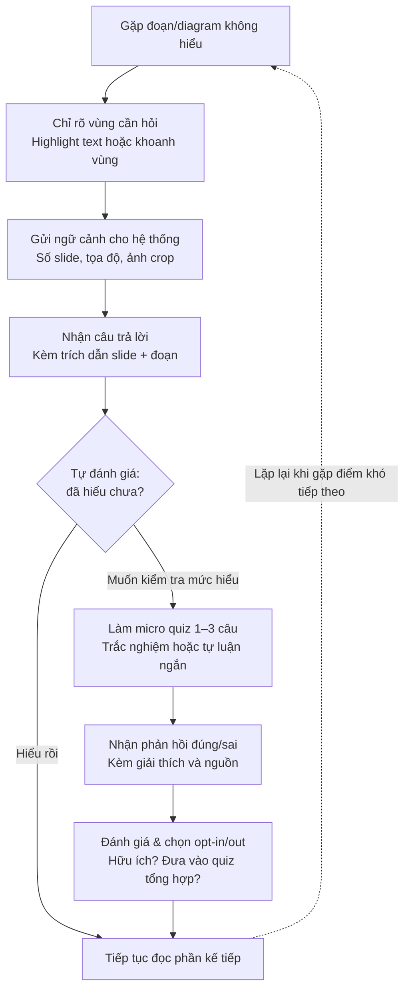

# AI SPEC — [Tên lát cắt] · Nhóm [B6-1] · Zone [3]
Hướng: [✅] A — VLearn  [ ] B — Trợ lý Học viên  [ ] C — Làn mở
Loại: [ ] Tối ưu tính năng có sẵn  [✅] Tính năng mới

## §1. User & Job
- Job executor + workflow (đính kèm worksheet JTBD / ảnh sơ đồ):
    ## Workflow

- Core JTBD (không tên sản phẩm/AI trong câu):
    Xác minh mức độ hiểu của mình về một đoạn nội dung cụ thể ngay khi vừa đọc xong, trước khi chuyển sang phần tiếp theo.
- Problem statement (KHÔNG chữ AI):
    Khi học viên tự học một bài giảng slide và gặp một đoạn văn, diagram hoặc bảng biểu cụ thể không hiểu, họ khó diễn đạt chính xác điều mình muốn hỏi và thường phải rời khỏi tài liệu để tra cứu ở nơi khác, khiến mạch đọc bị ngắt. Vì không có cách nào xác nhận ngay tại chỗ liệu mình đã hiểu đúng hay chưa, họ tiếp tục học dựa trên một hiểu biết chưa chắc chắn — và vấn đề chỉ lộ ra khi làm quiz tổng hợp cuối buổi, lúc đã quá trễ để quay lại đúng phần đó.
- Evidence (chuẩn A và/hoặc B — log đầy đủ trong repo):
  - Số liệu mining / kết quả khảo sát (n = ?, % xác nhận):
  - ≥5 quote/ví dụ nguyên văn + nguồn:

## §2. Impact & quyết định chọn
- Bảng impact ≥3 ứng viên (bao nhiêu người · tần suất · tốn gì mỗi lần · khả thi):
- Ứng viên ĐÃ LOẠI + vì sao:
- Ứng viên CHỌN + vì sao (bằng số):

## §3. Giải pháp tương tự đã nghiên cứu
- [Sản phẩm 1]: flow / đáng học / đáng né / mình khác gì
- [Sản phẩm 2]: ...

## §4. Thiết kế
- Lát cắt MỘT CÂU (1 user · 1 việc · 1 quyết định AI · 1 kết quả):
- Non-goals (≥3 thứ KHÔNG build):
- Mức prototype nhắm tới: [ ] Sketch [ ] Mock [ ] Working — phần nào mock, phần nào thật:
- Automation: [ ] augment [ ] conditional [ ] automate — lý do theo cost-of-error:
- §4b. Nguyên tắc đã áp dụng (≥4 — HAX/PAIR, xem guide):
  | Nguyên tắc | Áp cụ thể vào đâu trong prototype |
  |---|---|

## §5. Kiểu lỗi — 4 lớp chỗ khó + kịch bản (≥8) [bảng theo guide §2.5]

## §6. Bốn đường đi của trải nghiệm
- Happy path: · Low-confidence (②): · Failure/không căn cứ (①): · Correction (user sửa):
- Khi bị đòi ngoài phạm vi (③): · Case đặc thù domain (④):

## §7. Kiểm thử
- Chiều chất lượng + định nghĩa kiểm chứng được:
- Golden set (≥20 case theo cơ cấu trong guide §2.6, file trong eval/):
- Quality bar (chốt từ 23:59, giữ nguyên sau đó): "Đạt khi ≥ ___% qua bộ, và ___"
- Kết quả các lượt chạy (bảng % — cập nhật đến trước CP6):

## §8. Phân công & kế hoạch
- Phân công có tên: spec / evidence / prompt / code / demo
- Willing users (≥3 tên) + kế hoạch vòng validation CP5 (3 câu hỏi, ai log):
- Multi-prototype (nếu làm): trục khác biệt của ≥2 phương án + lý do chọn:

## §9. Changelog
| Thời điểm | Đổi gì | Vì sao (trỏ về feedback/case nào) |